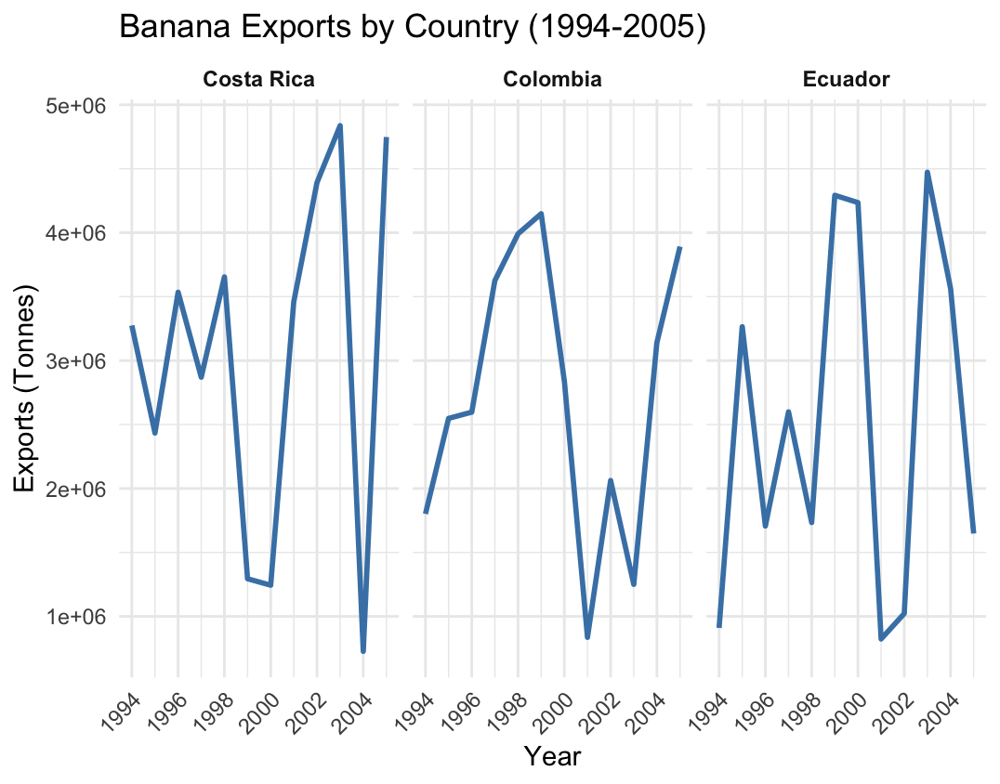
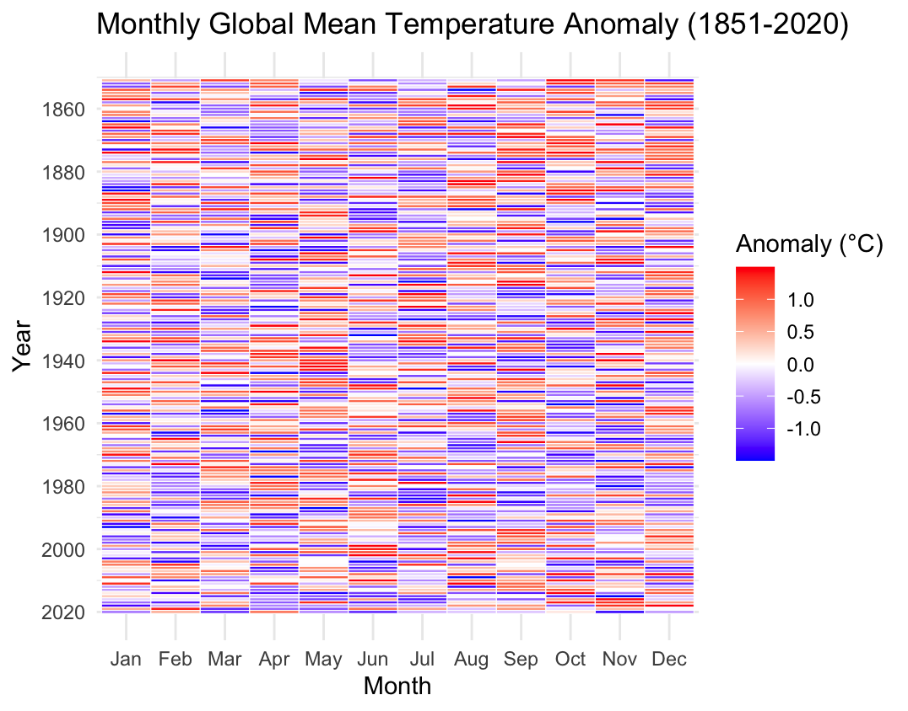
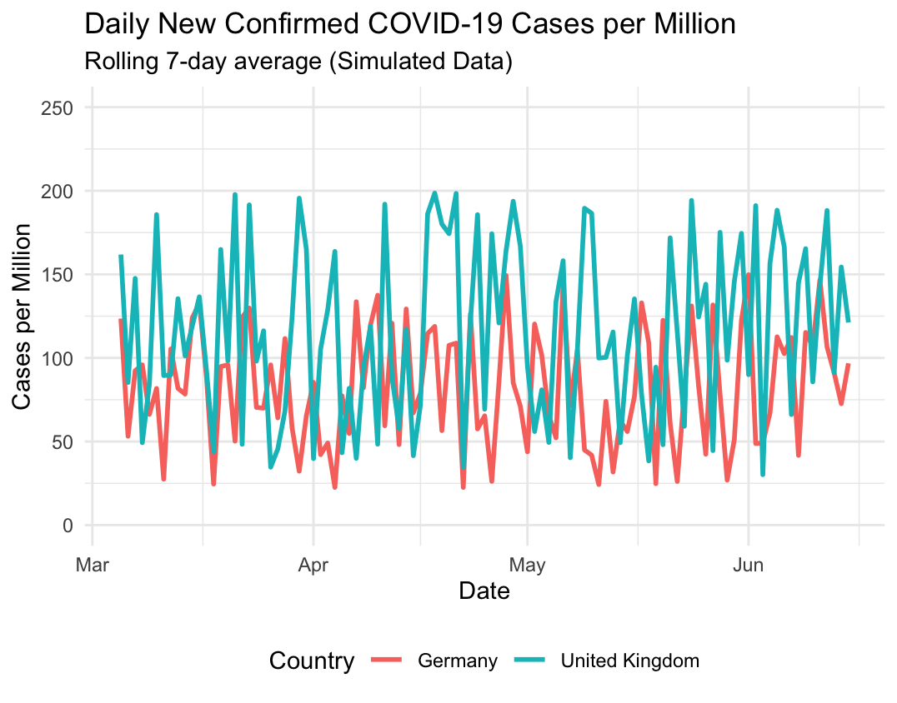
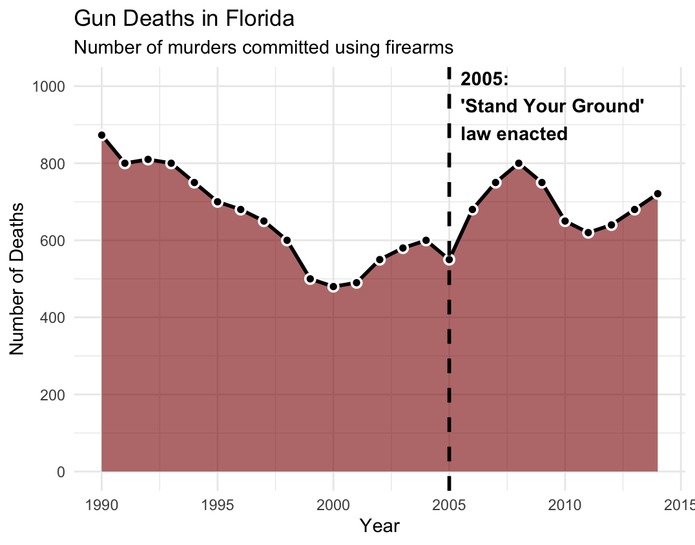

# Scientific Methodology and Performance Evaluation: Graphics Critique Report

This report evaluates and redesigns four flawed graphics from Jean-Marc's slides using the established checklist for good graphics[cite: 1, 2]. Each figure is critiqued for its classical errors and redesigned using `ggplot2` in R to ensure compliance with data visualization principles.

## Figure 1: Banana Exports (1994-2005)

### Critique
* **Confusing Scales & Non-Necessary Information:** The 3D perspective creates confusing scales, making it difficult to accurately read the values. The banana background image introduces non necessary informations and violates the principle to minimize ink.
* **Occam's Razor:** If two representations contain the same information, choose the simpler one. A 3D chart is unnecessarily complex for this data.
* **Categorical Ordering:** The countries on the x-axis are not based on classical ordering (e.g., alphabetical or from best to worst). 

### Better Representation
A 2D faceted line chart eliminates the 3D distortion, removes the background image, and handles multiple countries without overcrowding a single graph (which keeps the number of curves on a same graph small). 

## Figure 2: Monthly Global Mean Temperature Anomaly

### Critique
* **Nature of Data:** The grid of circular charts violates the rule that the type of the graphic must be adapted to the nature of data[cite: 2]. Time-series data is linear, not circular.
* **Too Many Graphical Objects:** The massive number of individual pie charts maximizes the effort required by the reader to extract meaningful trends, violating the fundamental principle to minimize efforts of the reader[cite: 1]. 

### Better Representation
A 2D heatmap perfectly adapts to the matrix nature of this data (Months vs. Years)[cite: 2]. It uses color gradients to show temperature changes, replacing hundreds of pie charts with a single, highly readable grid.

## Figure 3: Daily New Confirmed COVID-19 Cases

### Critique
* **Confusing Scales:** The y-axis features unadapted scales[cite: 1]. The visual distance between 30 and 40 is the same as the distance between 100 and 200, but scales and units must be explicits[cite: 2].
* **Axis Origin:** The y-axis does not start at 0, and because it is not clearly justified, it fails the guideline that the origin is (0, 0)[cite: 2].

### Better Representation
A standard line chart with a strictly linear scale and an explicit origin of (0,0) ensures the magnitude of the peaks and valleys is represented accurately.

## Figure 4: Gun Deaths in Florida

### Critique
* **Axis Orientation:** The most critical error is the inverted y-axis (0 at the top, 1000 at the bottom). This directly violates the rule that axes are oriented from the left to the right and from the bottom to the top[cite: 2].
* **Optical Illusion:** By inverting the axis and filling the area, a sharp increase in deaths visually looks like a decrease. This fails to minimize efforts of the reader[cite: 1].

### Better Representation
A standard area chart with a traditional bottom-to-top y-axis. The contextual annotation is preserved but moved to clear white space to ensure it does not overlap the data line.

